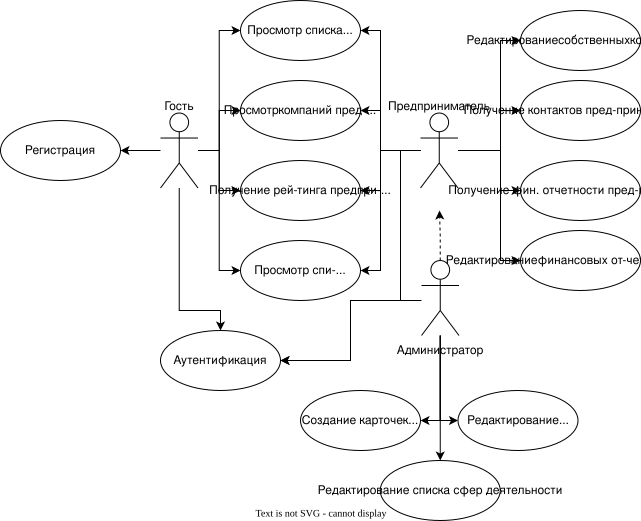
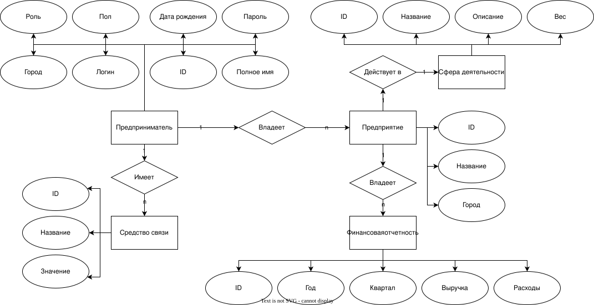
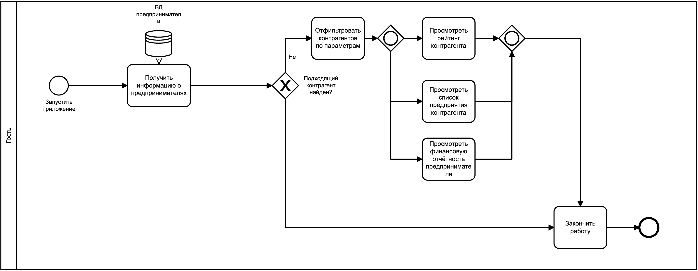
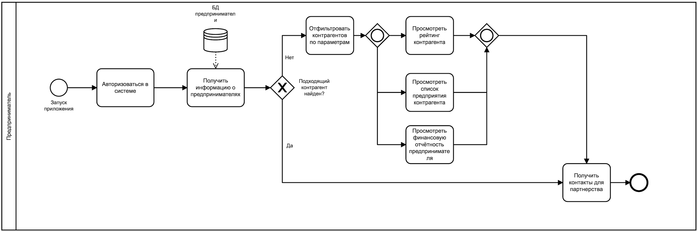
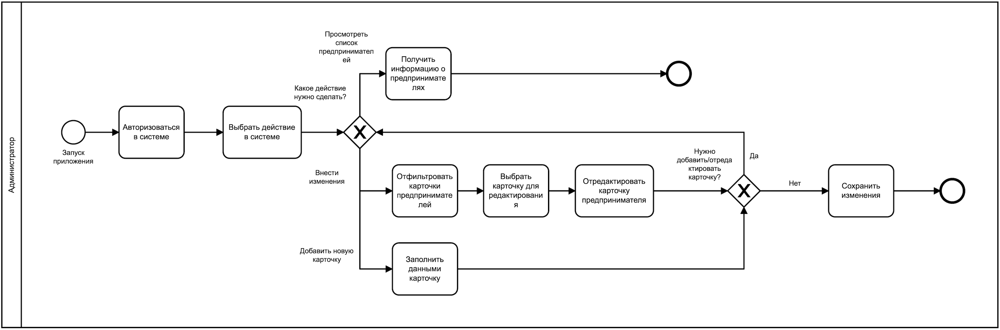
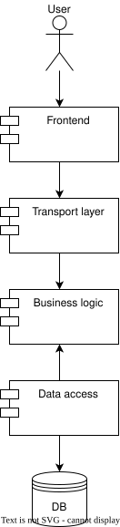

# ППО - Сервис поиска предпринимателей-партнеров

## Краткое описание идеи проекта

Данное приложение предоставляет возможность составления рейтингов предпринимателей, основываясь на различных параметрах фильтрации, с целью отбора подходящих кандидатов для партнерства. Каждый предприниматель имеет список предприятий, к которым он имеет отношение, с указанием собственной доли. Есть возможность определения уровня влияния предпринимателя в той или иной сфере на основании компаний в его портфеле.

## Краткое описание предметной области

Предметная область - предприниматели. Предприниматели оказывают влияние на некоторую сферу, владея предприятиями с определенными финансовыми показателями. У каждого предпринимателя есть список его навыков.

## Функциональные требования

1. Приложение должно позволять просматривать средства связи с предпринимателем только зарегистрированным пользователям.
2. Приложение должно позволять осуществлять поиск предпринимателей по ФИО.
3. Приложение должно позволять загружать отчеты о деятельности компаний.

## Краткий анализ аналогичных решений по минимум 3 критериям

Критерии:  
1. Просмотр списка предприятий предпринимателя.
2. Просмотр рейтинга предпринимателя.
3. Поиск предпринимателей по различным параметрам.

Решение                                          | 1 | 2 | 3 |
------------------------------------------------ | - | - | - |
[PartnerSearch](https://www.partnersearch.ru/)   | - | - | - |
[Точка Нетворк](https://tochka.com/rko/network/) | - | + | + |
[Intch](https://intch.org/)                      | - | + | + |
Предлагаемое решение                             | + | + | + |

## Краткое обоснование целесообразности и актуальности проекта

Некоторые предприниматели в поиске потенциальных партнеров сталкиваются с проблемой отсутствия обширной информации о присутствии тех или иных контрагентов в интересующей их сфере. Данное приложение призвано помочь найти людей и способы связи с ними для осуществления дальнейшей совместной коммерческой деятельности.

## Краткое описание акторов

### Гость 

Возможности:
- просмотр списка предпринимателей;
- просмотр списка компаний в портфеле предпринимателя;
- составление рейтингов предпринимателей на основании параметров фильтрации.

Не требует авторизацию.

### Предприниматель

Возможности:
- всё, что гость;
- получение контактов других предпринимателей;
- получение информации об оценке влияния других предпринимателей в некоторой сфере;
- получение финансовой отчетности о деятельности предпринимателя.

Требует авторизацию.

### Администратор

Возможности:
- всё, что предприниматель;
- создание карточек предпринимателей;
- редактирование информации о предпринимателях.

Требует авторизацию.

## Use-Case диаграмма

## ER-диаграмма

## Пользовательские сценарии

1. Гость зашел на главную страницу, с помощью фильтров ограничил выборку и получил список подходящих предпринимателей.

2. Предприниматель (авторизованный пользователь) перешел на главную, с помощью фильтров ограничил выборку, перешел на личную карточку первого предпринимателя и увидел его финансовую отчетность.

3. Гость открыл вкладку авторизации и стал авторизованным пользователем.

4. Администратор открыл панель редактирования карточек и изменил контактные данные предпринимателя Х.

5. Администратор создал личную карточку предпринимателя.

## Сложные сценарии

Основная сфера деятельности - сфера, прибыль с которой у предпринимателя составляет наибольшую часть.

Налоговая нагрузка = Сумма начисленных налогов за год / Сумма выручки за год × 100 %

1. Анализ рейтинга предпринимателя в зависимости от сфер, в которых он осуществляет свою деятельность (у каждой сферы будет закреплен её вес) и финансовых показателей деятельности по формуле $$ 1.2 \cdot a^2 + 0.35 \cdot b + 0.9 \cdot c ^ {1.5}, $$ где $a$ - вес основной сферы деятельности, $b$ - объем выручки за предыдущий год, $c$ - прибыль за предыдущий год.

2. Вычисление итоговой суммы налогов и наловой нагрузки предпринимателя по всем предприятиям в зависимости от прибыли (прогрессивная система налогообложения). 

Прибыль (млн руб/год)                                         | Налоговая ставка |
------------------------------------------------ | - |
Менее 10   | 4% |
Менее 50   | 7% |
Менее 150                      | 13% |
Менее 500                             | 20% |
Более 500                            | 30% |

## Формализация ключевых бизнес-процессов

## Тип приложения

Web SPA

## Технологический стек

- Backend: Golang
- Frontend: HTML, CSS
- DB: PostgreSQL

## Верхнеуровневое разбиение на компоненты

## Макет

Макет можно посмотреть [тут](https://www.figma.com/design/aea9eC2gIJPy7a05TspmWu/Untitled?node-id=0-1&node-type=canvas&t=FufmNMJPrnElPnZX-0). 

## Бенчмарк

### Без балансировки нагрузки

Server Software:        
Server Hostname:        127.0.0.1
Server Port:            8085

Document Path:          /api/v2/activity_fields?page=1
Document Length:        327 bytes

Concurrency Level:      100
Time taken for tests:   0.631 seconds
Complete requests:      5000
Failed requests:        0
Total transferred:      2250000 bytes
HTML transferred:       1635000 bytes
Requests per second:    7927.60 [#/sec] (mean)
Time per request:       12.614 [ms] (mean)
Time per request:       0.126 [ms] (mean, across all concurrent requests)
Transfer rate:          3483.81 [Kbytes/sec] received

Connection Times (ms)
min  mean[+/-sd] median   max
Connect:        0    1   0.9      0       4
Processing:     3   12   7.8     10      81
Waiting:        3   11   7.8     10      81
Total:          4   12   7.9     11      83
WARNING: The median and mean for the initial connection time are not within a normal deviation
These results are probably not that reliable.

Percentage of the requests served within a certain time (ms)
50%     11
66%     13
75%     14
80%     15
90%     18
95%     19
98%     36
99%     63
100%     83 (longest request)

### С балансировкой нагрузки

Server Software:        nginx
Server Hostname:        127.0.0.1
Server Port:            80

Document Path:          /api/v2/activity_fields?page=1
Document Length:        325 bytes

Concurrency Level:      100
Time taken for tests:   1.316 seconds
Complete requests:      5000
Failed requests:        0
Total transferred:      2595000 bytes
HTML transferred:       1625000 bytes
Requests per second:    3799.01 [#/sec] (mean)
Time per request:       26.323 [ms] (mean)
Time per request:       0.263 [ms] (mean, across all concurrent requests)
Transfer rate:          1925.47 [Kbytes/sec] received

Connection Times (ms)
min  mean[+/-sd] median   max
Connect:        0    1   1.0      0       5
Processing:     6   25  21.9     19     160
Waiting:        4   25  21.9     18     159
Total:          6   26  21.9     19     160
WARNING: The median and mean for the initial connection time are not within a normal deviation
These results are probably not that reliable.

Percentage of the requests served within a certain time (ms)
50%     19
66%     23
75%     28
80%     32
90%     44
95%     68
98%    123
99%    137
100%    160 (longest request)
